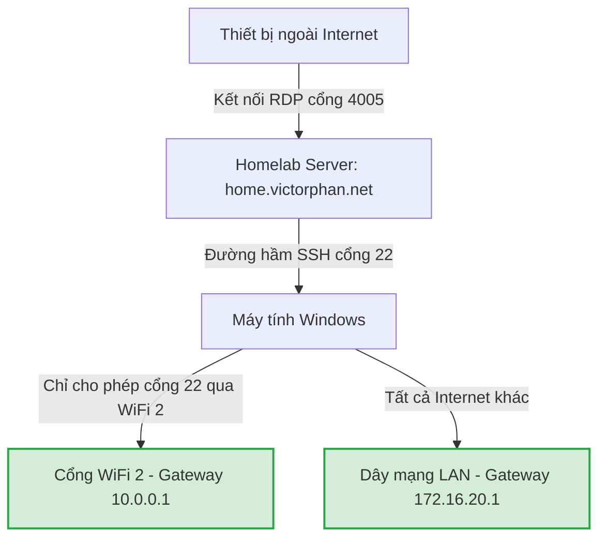
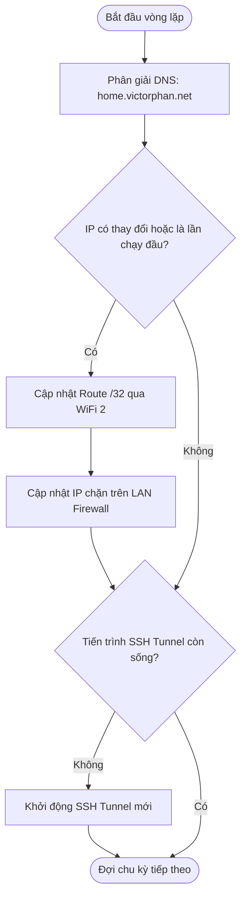

# Hướng dẫn Xây dựng Ứng dụng/Service Định tuyến RDP và Chặn Internet

Tài liệu này tổng hợp toàn bộ giải pháp mạng, câu lệnh và thuật toán logic để bạn tự phát triển thành một ứng dụng chạy ngầm (Windows Service) hoặc một công cụ tự động hóa hoàn chỉnh.

---

## 1. Thiết kế Hệ thống & Mô hình Hoạt động

Mục tiêu là định cấu hình cho máy chạy song song hai đường mạng:
* **LAN (Ethernet)**: Dùng làm đường mạng chính để duyệt Web, cập nhật, gửi nhận dữ liệu Internet thông thường.
* **WiFi 2** (Kết nối tới `Wifi-Khach`): Chỉ dùng để thiết lập đường hầm SSH / RDP tới Homelab Server bên ngoài Internet (`home.victorphan.net`). Toàn bộ lưu lượng Internet khác trên WiFi 2 bị chặn.



---

## 2. Các thành phần Core Logic (API / Commands)

Nếu bạn viết ứng dụng bằng C#, Go, Rust hoặc Python, bạn có thể gọi trực tiếp các lệnh hệ thống bên dưới hoặc sử dụng API tương đương của hệ điều hành.

### A. Thiết lập độ ưu tiên Card mạng (Interface Metric)
Cần đảm bảo card LAN luôn có độ ưu tiên cao hơn WiFi 2 để làm cổng Internet mặc định:
```powershell
# Chạy một lần duy nhất lúc khởi tạo dịch vụ
Set-NetIPInterface -InterfaceAlias "Ethernet" -InterfaceMetric 10
Set-NetIPInterface -InterfaceAlias "WiFi 2" -InterfaceMetric 500
```

### B. Cấu hình Tường lửa (Firewall Rules) trên WiFi 2
Chặn toàn bộ lưu lượng ra/vào Internet trên WiFi 2 nhưng **chừa lại cổng 22 (SSH)** để thiết lập Tunnel:
```powershell
# 1. Chặn toàn bộ cổng TCP outbound ngoại trừ cổng 22 (SSH)
New-NetFirewallRule -DisplayName "Block Outbound TCP on WiFi 2 except SSH" -Direction Outbound -InterfaceAlias "WiFi 2" -Action Block -Protocol TCP -RemotePort "1-21", "23-65535"

# 2. Chặn toàn bộ cổng UDP outbound (Ngăn DNS và các giao thức UDP đi qua WiFi 2)
New-NetFirewallRule -DisplayName "Block Outbound UDP on WiFi 2" -Direction Outbound -InterfaceAlias "WiFi 2" -Action Block -Protocol UDP
```

### C. Định tuyến Tĩnh (Static Route) & Chặn Leakage trên LAN
Khi tên miền DDNS `home.victorphan.net` thay đổi IP (gọi là `$currentIP`):
```powershell
# 1. Ép IP của Homelab Server đi qua WiFi 2
New-NetRoute -DestinationPrefix "$currentIP/32" -InterfaceAlias "WiFi 2" -NextHop "10.0.0.1" -RouteMetric 5 -Confirm:$false

# 2. Chặn không cho phép kết nối tới IP Homelab Server bằng cổng LAN (Ethernet) để tránh rò rỉ khi WiFi mất kết nối
New-NetFirewallRule -DisplayName "Block VPS on Ethernet" -Direction Outbound -InterfaceAlias "Ethernet" -Action Block -RemoteAddress $currentIP
```

---

## 3. Bản thiết kế Logic cho Ứng dụng Service (Algorithm Blueprint)

Khi viết mã nguồn cho Service (ví dụ bằng C#, Go, Python...), chương trình của bạn nên chạy theo luồng thuật toán sau:

### Luồng khởi chạy dịch vụ (Service Start / Init)
1. **Kiểm tra quyền:** Đảm bảo ứng dụng đang chạy dưới quyền Administrator/SYSTEM.
2. **Khởi tạo hạ tầng mạng:**
   * Áp dụng Metric cho `Ethernet` (10) và `WiFi 2` (500).
   * Tạo các luật chặn cổng TCP/UDP mặc định trên `WiFi 2`.

### Vòng lặp định kỳ (Periodic Loop - ví dụ mỗi 5-15 phút)


#### Code mẫu kiểm tra và duy trì tiến trình SSH trong Service (PowerShell làm mẫu):
```powershell
# Kiểm tra nếu tiến trình ssh chạy ngầm bị tắt
$sshProcess = Get-Process -Name ssh -ErrorAction SilentlyContinue | Where-Object { $_.CommandLine -like "*home.victorphan.net*" }

if (-not $sshProcess) {
    Write-Output "SSH Tunnel is down. Restarting..."
    # Khởi chạy ngầm SSH Tunnel
    Start-Process -FilePath "ssh.exe" -ArgumentList "-N -R 4005:localhost:3389 x79@home.victorphan.net" -WindowStyle Hidden
}
```

---

## 4. Gợi ý phương án đóng gói thành Windows Service

Để chạy script/ứng dụng này tự động 24/7 mà không cần mở cửa sổ dòng lệnh:

### Cách 1: Sử dụng NSSM (Non-Sucking Service Manager) - *Khuyên dùng cho script/file exe*
1. Tải công cụ **NSSM** (nhẹ, mã nguồn mở, không cần cài đặt).
2. Mở cmd quyền Admin và chạy lệnh để cài đặt file `.ps1` thành một Service thực thụ:
   ```cmd
   nssm install "HomelabRDPService" Powershell.exe "-ExecutionPolicy Bypass -File C:\Users\NASPC\Sync-Homelab.ps1"
   ```
3. Cấu hình trong NSSM tab **Details**: đặt Startup type là `Automatic`.
4. Tab **Logon**: Chọn chạy dưới tài khoản có quyền quản trị hoặc `Local System`.

### Cách 2: Sử dụng Windows Task Scheduler (Bộ lập lịch tác vụ)
Tạo một Task chạy khi máy khởi động (Startup) và lặp lại mỗi 10 phút:
* **Trigger**: `At startup`.
* **Action**: `Start a program`.
  * Program/script: `powershell.exe`
  * Arguments: `-WindowStyle Hidden -ExecutionPolicy Bypass -File "C:\Users\NASPC\Sync-Homelab.ps1"`
* **Security Options**: Tích chọn `Run whether user is logged on or not` và `Run with highest privileges`.
